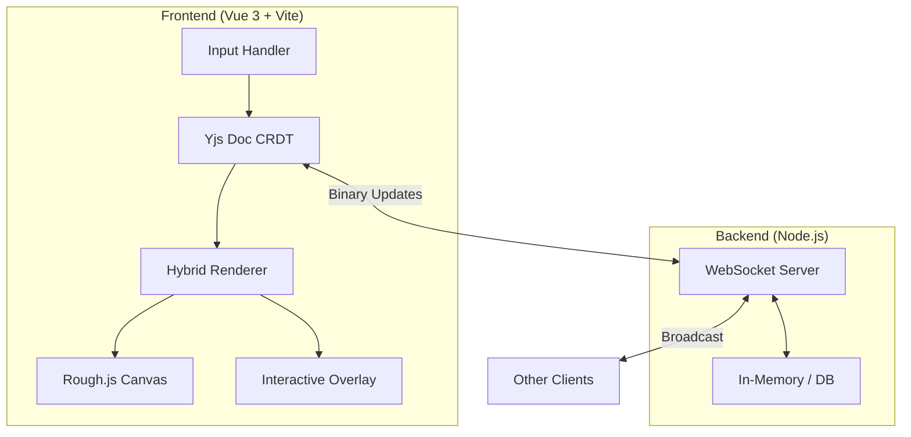
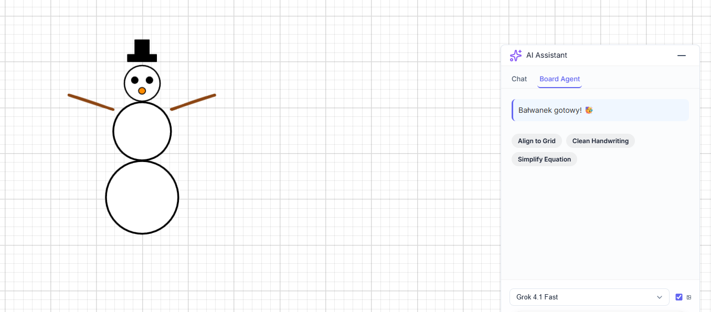
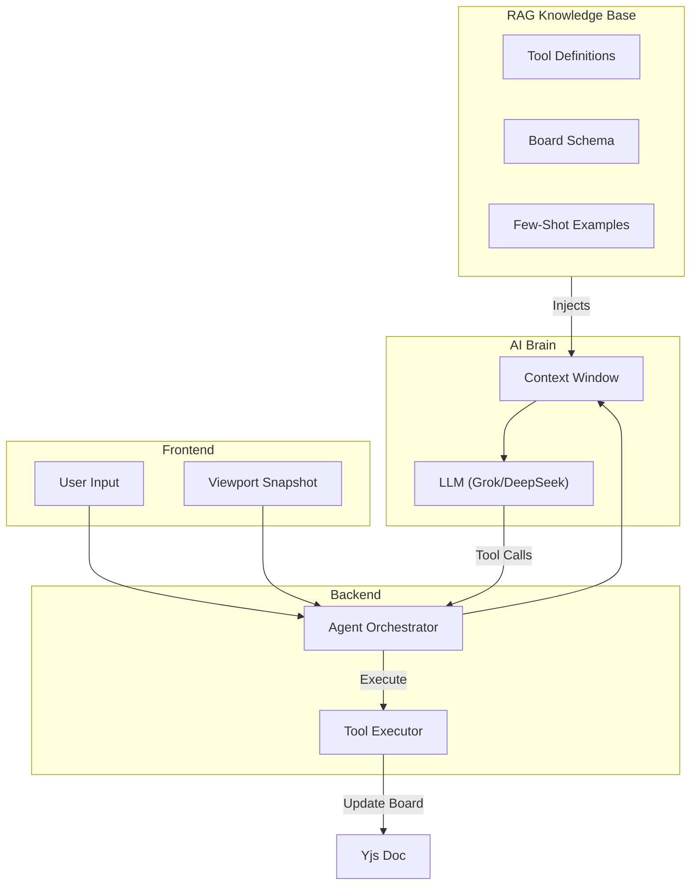

# WhiteVue

WhiteVue is a high-performance, real-time collaborative whiteboard built for technical teams. It merges the flexibility of a vector-based canvas with the reliability of CRDT synchronization, allowing multiple users to brainstorm, diagram, and solve problems together without conflict.

**Live Demo:** [https://frontend-copy-production-2b71.up.railway.app](https://frontend-copy-production-2b71.up.railway.app)

## Architecture Overview

WhiteVue adopts a **Local-First** architecture.   The application state lives primarily on the client, managed by a CRDT (Conflict-free Replicated Data Type) document. Synchronization happens in the background via WebSockets, ensuring the app remains responsive even under poor network conditions.



## Core Engineering Challenges & Solutions

Building a whiteboard that feels "native" while  supporting real-time multiplayer involves solving several complex distributed system problems.

### 1. The "Sticky" Binding System
**The Challenge:** In a diagramming tool, lines must stay attached to shapes. If a user connects an arrow to a rectangle and then rotates that rectangle 45 degrees, the arrow should follow the specific anchor point (e.g., "top-center") naturally. Standard bounding-box logic fails here.

**The Solution:** We implemented a custom **Binding Protocol** on top of our CRDT structure.
*   Instead of just storing `x,y` coordinates for line endpoints, we store a `bindingPayload` containing the target object's ID and a normalized relative coordinate (e.g., `0.5, 0` for top-center).
*   We utilize **Yjs Transactions** (`ydoc.transact`) to create atomic updates. When a shape is moved or resized, a reactive watcher detects the change and triggers a `auto-binding` transaction that recalculates and updates the coordinates of all attached lines in the same tick. This ensures that all users see the lines move in perfect sync with the shape, with no visual lag or "detachment" artifacts.

### 2. Hybrid Rendering Pipeline
**The Challenge:** HTML5 Canvas is performant for drawing thousands of strokes but poor for interaction (no DOM events for individual shapes). DOM elements are great for interaction but heavy to render in large numbers.

**The Solution:** WhiteVue uses a **Dual-Layer Rendering Engine**:
*   **The Bottom Layer (Canvas):** Uses **Rough.js** to render the actual visual content. This library generates "hand-drawn" SVG paths which we rasterize onto a single HTML5 Canvas.
    *   **Optimization - Path2D Caching:** Static pen strokes are baked into `Path2D` objects, eliminating the need to re-parse thousands of point coordinates on every render frame.
    *   **Optimization - Geometry Simplification:** Freehand strokes are processed with the **Ramer-Douglas-Peucker** algorithm to remove redundant points while preserving the shape's visual fidelity.
*   **The Top Layer (Vue Components):** We overlay lightweight Vue components (`MovableObject`) on top of the canvas. These components are invisible by default but handle hit-testing, selection boxes, and resize handles.
    *   **Optimization - Smart DOM Culling:** Heavy DOM elements (for text/LaTeX) are only mounted when necessary (e.g., for complex types or currently selected objects), keeping the DOM tree lightweight.
*   **Synchronization:** A central `CoordinateSystem` utility maps the infinite pan/zoom canvas space to the viewport pixels, ensuring the DOM overlay always aligns perfectly with the canvas drawing.

### 3. Conflict-Free State Management
**The Challenge:** In a naive implementation, if User A moves an object and User B deletes it simultaneously, the app crashes. Or if two users drag the same object, it "jitters" between positions.

**The Solution:** We use **Yjs** as our source of truth.
*   **Data Structure:** The entire board state is a `Y.Array` of `Y.Map` objects.
*   **Resolution:** Yjs automatically handles property conflicts using a "Last-Write-Wins" strategy for simple properties (like color) and sophisticated list merging for array data.
*   **Awareness:** For ephemeral data that shouldn't be saved (like cursor positions or "who is selecting what"), we use the `y-protocols/awareness` protocol.

### 4. AI Assistant & Agentic Capabilities
**The Challenge:** Standard chatbots are passive; they can talk but cannot *do*. A true whiteboard assistant needs to act—moving objects, fixing messy drawings, and generating content directly on the canvas.

**The Solution:** We built a **Multimodal Agentic System** powered by RAG and Tool Use.


*Figure: The AI Agent autonomously drawing a snowman using primitive shapes and the `draw_handstroke` tool, demonstrating spatial awareness and creativity.*

*   **Vision & Context:** When a user asks a question, we capture a high-resolution viewport snapshot and combine it with a JSON representation of the board state. This allows the AI (xAI Grok Vision / DeepSeek) to "see" and "read" the diagram simultaneously.
*   **Agentic Tool Use:** The AI isn't just a chatbot; it has direct access to board manipulation tools:
    *   **Creative & Freehand**:
        *   **`draw_handstroke`**: Allows the agent to draw natural, hand-written strokes (as seen in the snowman example).
        *   **`draw_board_patch`**: General-purpose tool for creating shapes and annotations.
    *   **Structure & Logic**:
        *   **`connect_objects`**: Intelligently connects shapes with arrows, understanding anchors and layout.
        *   **`label_object`**: Adds semantic labels (Text or LaTeX) to existing objects.
    *   **Math & Science**:
        *   **`insert_latex_box`** & **`plot_function`**: For rendering complex formulas and data plots.
    *   **Editing & Refinement**:
        *   **`set_style`**: Batch updates styles (color, stroke, etc.).
        *   **`delete_objects`**: Removes unwanted elements.
        *   **`align_selection_to_grid`**: Organizes messy layouts.

*   **RAG (Retrieval-Augmented Generation):** To ensure the agent uses these tools correctly, we dynamically inject relevant documentation and schema definitions into its context window.

#### Agentic RAG Architecture



## Tech Stack

*   **Frontend:** Vue 3, Vite, TailwindCSS (for UI panels)
*   **Graphics:** HTML5 Canvas, Rough.js (hand-drawn style), Katex (math rendering)
*   **State:** Yjs (CRDT), y-websocket
*   **Backend:** Node.js, Express, WebSocket (ws)

## Installation

1.  **Clone the repo:**
    ```bash
    git clone https://github.com/kordin33/WhiteVue.git
    cd WhiteVue
    ```

2.  **Start Backend:**
    ```bash
    cd server
    npm install
    npm run dev
    ```

3.  **Start Frontend:**
    ```bash
    cd frontend
    npm install
    npm run dev
    ```

4.  **Open:** `http://localhost:5173`

## Future Roadmap

*   **End-to-End Encryption:** Client-side encryption of Yjs updates before they hit the WebSocket.
*   **Time Travel:** A slider to replay the entire history of the whiteboard session.
*   **Plugin System:** API for third-party developers to add custom shapes and tools.
